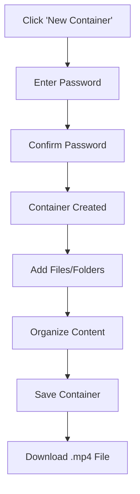
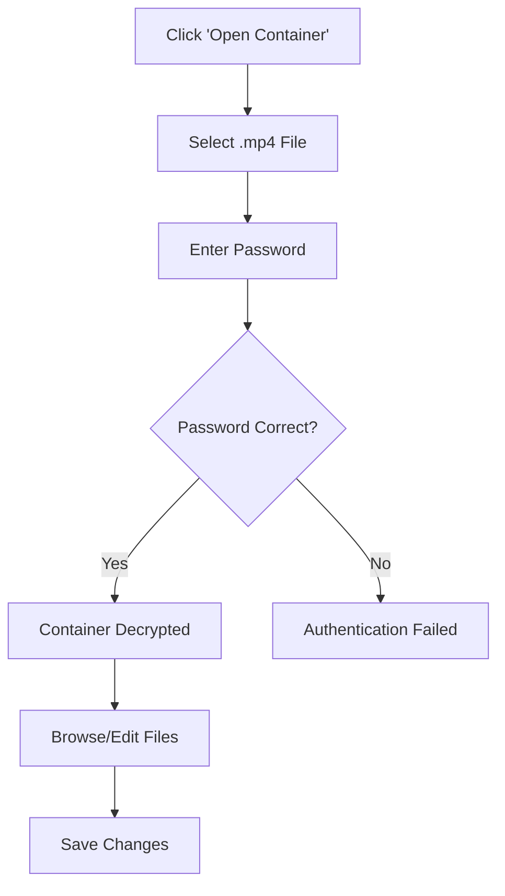
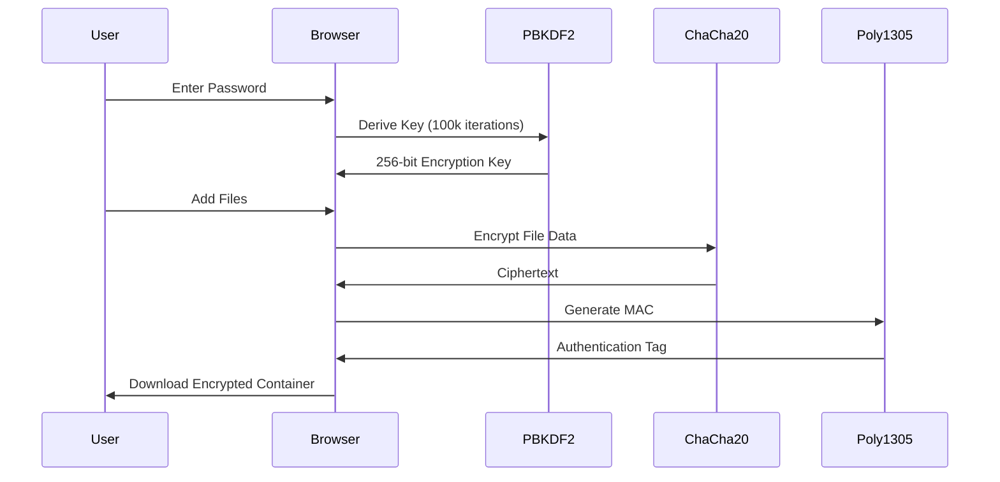
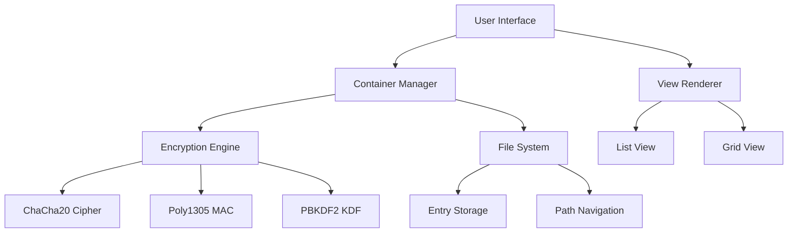

# xsukax Encrypted File Container

[](https://xsukax.github.io/xsukax-Encrypted-File-Container)
[](https://www.gnu.org/licenses/gpl-3.0)

A zero-trust, client-side encrypted file container application that uses military-grade ChaCha20-Poly1305 encryption to secure your files. All encryption and decryption operations happen exclusively in your browser—no data is ever transmitted to any server.

**Demo:** [https://xsukax.github.io/xsukax-Encrypted-File-Container](https://xsukax.github.io/xsukax-Encrypted-File-Container)

## 🎯 Project Overview

xsukax Encrypted File Container is a standalone, browser-based application designed to create secure, password-protected file containers disguised as MP4 video files. The application enables users to:

- **Encrypt multiple files and folders** into a single container file
- **Store sensitive data** with authenticated encryption (AEAD)
- **Organize files** with a full-featured file explorer interface
- **Edit text files** directly within the encrypted container
- **Search and manage** encrypted content with ease
- **Export containers** as `.mp4` files for inconspicuous storage

The entire application is contained in a single HTML file with no external dependencies, making it portable, auditable, and completely offline-capable.

## 🔒 Security and Privacy Benefits

### Client-Side Encryption
All cryptographic operations are performed entirely within your browser using native JavaScript implementations. Your files, passwords, and encryption keys **never leave your device** and are **never transmitted over the network**.

### ChaCha20-Poly1305 AEAD Cipher
The application implements the **ChaCha20-Poly1305** authenticated encryption algorithm, which provides:

- **Confidentiality:** ChaCha20 stream cipher ensures data cannot be read without the correct key
- **Authenticity:** Poly1305 MAC prevents tampering and verifies data integrity
- **Performance:** Optimized for both security and speed on all platforms

### Key Derivation
Passwords are transformed into encryption keys using **PBKDF2** (Password-Based Key Derivation Function 2) with:

- **100,000 iterations** for resistance against brute-force attacks
- **SHA-256** hash function
- **32-byte random salt** unique to each container

### Zero-Trust Architecture
The application follows a zero-trust security model:

- No server-side processing or storage
- No telemetry or analytics
- No external API calls
- Complete offline functionality
- Open-source code available for independent security audits

### Steganographic Container Format
Encrypted containers are saved with the `.mp4` extension, allowing them to blend in with regular video files in your file system. While not true steganography, this provides an additional layer of obscurity.

## ✨ Features and Advantages

### Core Functionality
- **Single-File Application:** No installation required—just open the HTML file in any modern browser
- **Password Protection:** Secure your containers with strong, user-defined passwords
- **Multi-File Support:** Add individual files, multiple files, or entire folder structures
- **Folder Organization:** Create and manage nested folder hierarchies within containers
- **File Operations:** Create, edit, rename, delete, and download files seamlessly
- **Search Capability:** Quickly locate files by name or path across the entire container

### User Experience
- **Modern GitHub-Inspired UI:** Clean, professional interface with light mode styling
- **Dual View Modes:** Switch between list view and grid view for optimal file browsing
- **Drag-and-Drop Support:** Intuitive file and folder uploads via drag-and-drop
- **Real-Time Editing:** Built-in text editor for modifying text-based files
- **Progress Indicators:** Visual feedback during encryption, decryption, and file operations
- **Breadcrumb Navigation:** Easy navigation through folder hierarchies

### Technical Advantages
- **Pure JavaScript Implementation:** No native dependencies or browser extensions required
- **Cross-Platform Compatibility:** Works on Windows, macOS, Linux, and mobile devices
- **No Backend Required:** Host on any static web server or run locally
- **Portable Containers:** Encrypted containers can be transferred and opened anywhere
- **Auditable Code:** All cryptographic implementations are visible and verifiable

## 🚀 Installation Instructions

### Method 1: Direct Download
1. Download the `index.html` file from this repository
2. Save it to your preferred location on your device
3. Open the file in any modern web browser (Chrome, Firefox, Safari, Edge)

### Method 2: Clone Repository
```bash
git clone https://github.com/xsukax/xsukax-Encrypted-File-Container.git
cd xsukax-Encrypted-File-Container
```

Then open `index.html` in your browser.

### Method 3: Use Online Demo
Visit the live demo at: [https://xsukax.github.io/xsukax-Encrypted-File-Container](https://xsukax.github.io/xsukax-Encrypted-File-Container)

### Browser Requirements
- Modern browser with ES6+ support
- JavaScript enabled
- Web Crypto API support (available in all modern browsers)

### Optional: Self-Hosting
To host on your own web server:

1. Copy `index.html` to your web server's document root
2. Ensure the web server serves the file with proper MIME type (`text/html`)
3. Access via HTTPS for enhanced security (recommended)

**Note:** No special server-side configuration or PHP is required. This is a purely client-side application.

## 📖 Usage Guide

### Creating a New Container



1. **Launch Application:** Open `index.html` in your browser
2. **Create Container:** Click "New Container" button
3. **Set Password:** Enter a strong encryption password (minimum 8 characters recommended)
4. **Confirm Password:** Re-enter the password to prevent typos
5. **Add Content:** Use the toolbar buttons or drag-and-drop to add files
6. **Save Container:** Click "💾 Save Container" to download the encrypted `.mp4` file

### Opening an Existing Container



1. **Open Container:** Click "Open Container" button
2. **Select File:** Choose the encrypted `.mp4` container file
3. **Enter Password:** Provide the correct decryption password
4. **Access Content:** Browse, edit, or extract files from the container

### File Operations

#### Adding Files
- **Individual Files:** Click "➕ Add Files" and select files
- **Multiple Files:** Select multiple files using Ctrl/Cmd + Click
- **Folders:** Click "📁 Add Folder" to add entire directory structures
- **Drag-and-Drop:** Drag files or folders directly onto the interface

#### Managing Files
- **Create New File:** Click "📄 New File" to create an empty text file
- **Create Folder:** Click "🗂️ New Folder" to create a new directory
- **Edit File:** Select a text file and click "✏️ Edit" to open the built-in editor
- **Rename:** Select an item and click "✏️ Rename"
- **Delete:** Select items and click "🗑️ Delete" (supports multi-select with Ctrl/Cmd)
- **Download:** Select files and click "⬇️ Download" to export them

#### Navigation
- **Breadcrumb Navigation:** Click folder names in the breadcrumb to navigate up
- **Double-Click Folders:** Double-click folders to enter them
- **Search:** Use the search box to find files across the entire container
- **View Modes:** Switch between list view (📋) and grid view (🔲)

### Encryption Workflow



### Best Practices

#### Password Security
- Use strong, unique passwords (12+ characters)
- Combine uppercase, lowercase, numbers, and symbols
- Store passwords securely (password manager recommended)
- Never reuse passwords across different containers

#### File Management
- Organize files in folders for easier navigation
- Use descriptive file names
- Regularly save your container after making changes
- Keep backup copies of important containers

#### Security Recommendations
- Always verify the container opens correctly after saving
- Close the browser tab when finished to clear memory
- Use HTTPS when accessing the application online
- Clear browser cache if using a shared computer

## 🛡️ Container File Format

The encrypted container follows a custom binary format:

```
[4 bytes]   Magic Number: "XEFC" (0x58454643)
[2 bytes]   Version: 1
[32 bytes]  Salt for key derivation
[12 bytes]  Metadata Nonce
[4 bytes]   Metadata Length
[variable]  Encrypted Metadata (JSON)
[16 bytes]  Metadata Authentication Tag
[variable]  Encrypted File Data Blocks (each with nonce, length, data, tag)
```

## 🧪 Technical Architecture



### Core Components

- **ChaCha20 Class:** Stream cipher implementation for encryption/decryption
- **Poly1305 Class:** Message authentication code for integrity verification
- **ChaCha20Poly1305 Class:** AEAD wrapper combining both primitives
- **EncryptedContainer Class:** Container management and serialization
- **App Class:** UI controller and event handler

## ⚠️ Important Notes

- **Password Recovery:** There is no password recovery mechanism. Lost passwords mean permanently lost data.
- **Memory Limitations:** Very large files may cause performance issues due to browser memory constraints
- **Browser Compatibility:** Requires modern browser with Web Crypto API support
- **No Cloud Sync:** Containers are stored locally; users must manage their own backups

## 📜 License

This project is licensed under the GNU General Public License v3.0.

## 🤝 Contributing

Contributions are welcome! Please feel free to submit issues, feature requests, or pull requests.

## 🔗 Links

- **Repository:** [https://github.com/xsukax/xsukax-Encrypted-File-Container](https://github.com/xsukax/xsukax-Encrypted-File-Container)
- **Live Demo:** [https://xsukax.github.io/xsukax-Encrypted-File-Container](https://xsukax.github.io/xsukax-Encrypted-File-Container)
- **ChaCha20-Poly1305 Specification:** [RFC 8439](https://tools.ietf.org/html/rfc8439)

## 🙏 Acknowledgments

- ChaCha20-Poly1305 cipher designed by Daniel J. Bernstein
- UI inspired by GitHub's design system
- Built with vanilla JavaScript for maximum transparency and auditability

---

**⚡ Zero Trust. Client-Side. Secure by Design.**
